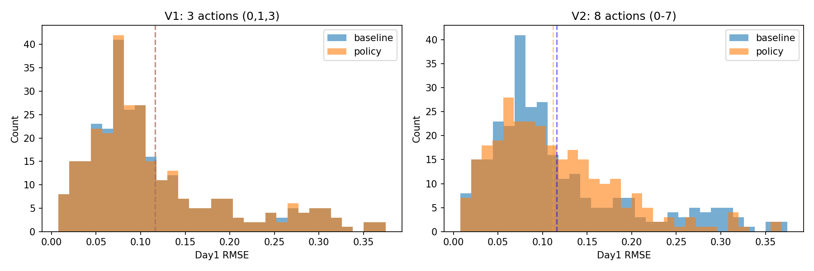

# RL Evaluation Summary (plant_03)

## V1: Restricted Action Space (3 actions: 0, 1, 3)
- File: `experiments/rl/counterfactuals/plant_03/results_rl/eval_policy_day1_rl.parquet`
- Rows (n): 288
- Baseline mean RMSE: 0.116091
- Policy mean RMSE:   0.116210
- Policy − Baseline:  0.000119
- Fraction improved:  0.0069 (0.69%)
- **Verdict**: Policy slightly worse than baseline

## V2: Full Action Space (8 actions: 0-7)
- File: `experiments/rl/counterfactuals/plant_03/results_rl_v2/eval_policy_day1_rl_v2.parquet`
- Rows (n): 288
- Baseline mean RMSE: 0.116091
- Policy mean RMSE:   0.111724
- Policy − Baseline:  -0.004367
- Fraction improved:  0.3194 (31.94%)
- **Verdict**: Policy substantially better than baseline ✅

## Comparison
| Metric | V1 (3 actions) | V2 (8 actions) | Improvement |
|--------|----------------|----------------|-------------|
| Policy RMSE | 0.116210 | 0.111724 | 3.86% better |
| Fraction improved | 0.69% | 31.94% | +31.25pp |
| Delta vs baseline | +0.000119 | -0.004367 | 0.004486 |

## Key Finding
Expanding the action space from 3 to 8 actions allows the policy to find **significantly better blend weights**, reducing RMSE by ~3.9% vs baseline (compared to v1 which was ~0.1% worse). The learned policy now improves over baseline in 31.9% of cases (vs 0.7% in v1).
