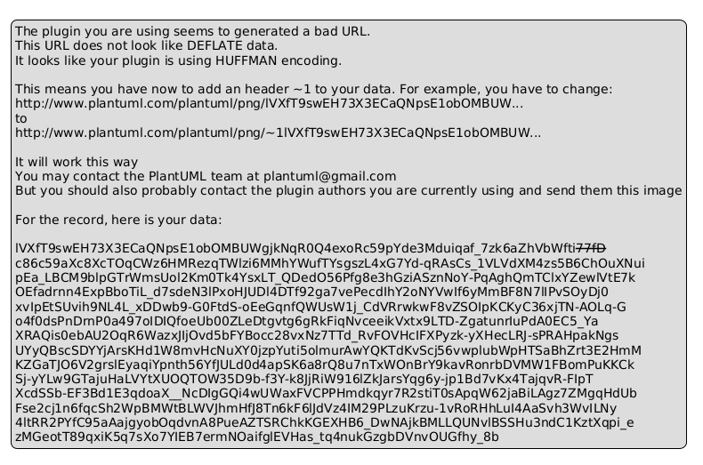
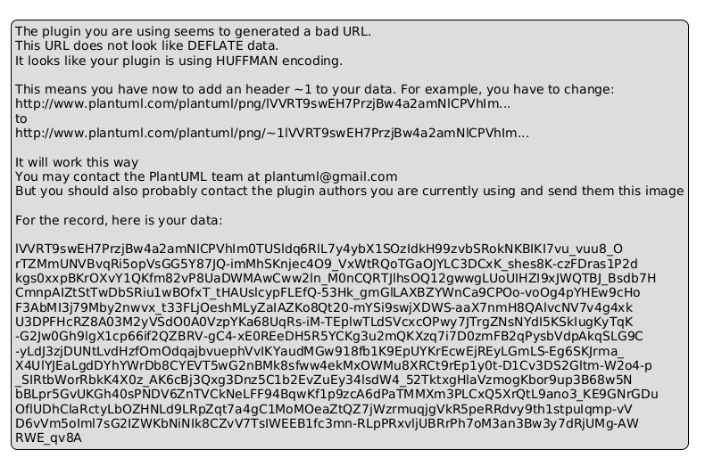

# Chapter 3 — Methodology: MiRACLE Framework Architecture

## 3.1 System Overview

MiRACLE (Meta-Intelligent Reinforcement-driven Adaptive Control for Learning-based Ensembles) is an end-to-end forecasting framework designed to produce **30-day photovoltaic (PV) power forecasts** at **15-minute resolution** under realistic operational constraints (imperfect weather forecasts, long-horizon uncertainty growth, and distribution shift over time).

At a high level, MiRACLE is organized into three tightly-coupled subsystems:

1. **Physics-informed feature engineering (PVLib)** — encodes known solar geometry and irradiance physics to stabilize learning and enforce physical plausibility.
2. **Hybrid deep learning ensemble (LSTM encoder + Temporal Fusion Transformer)** — combines a compact temporal representation (learned encoder) with a high-capacity multi-horizon forecaster.
3. **RL meta-controller (Double DQN)** — supervises operational decisions (e.g., which action to take under drift/uncertainty) and can be evaluated against a baseline policy.

### 3.1.1 Master architecture diagram and data flow

**Master high-level diagram:**



Vector/PDF version: [../figures/architecture/miracle_high_level.pdf](../figures/architecture/miracle_high_level.pdf)

This diagram captures the main data flow:

1. **Historical PV output + historical weather** are processed by a historical preprocessor (“Preprocessor A”).
2. The **LSTM encoder** is pretrained and then used to generate learned temporal representations.
3. **PVLib** generates physics features (solar position, POA irradiance, physics baselines).
4. **Real-time / inference-time weather forecasts** (Weather API) are processed by a real-time preprocessor (“Preprocessor B”).
5. A **feature store** merges weather features, PVLib features, and learned embeddings.
6. The **TFT forecaster(s)** consume the engineered features and produce predictions.
7. The **RL meta-controller** observes errors/drift signals and can adjust operational routing/cadence decisions.

**Under-the-hood pipeline diagram:**



Vector/PDF version: [../figures/architecture/miracle_full_data_pipeline.pdf](../figures/architecture/miracle_full_data_pipeline.pdf)

### 3.1.2 Implementation mapping (code-level)

The conceptual blocks map to repository modules as follows:

- **PVLib + physics-aware combination (“physics glue”)**: `src/inference/physics_glue.py`
- **Global/regional LSTM encoder training**: `src/training/train_global_lstm_v3.py`, `src/training/train_regional_lstm.py`
- **LSTM encoder architecture (Lightning)**: `src/models/lstm_encoder.py`, `src/models/global_lstm_encoder.py`
- **RL meta-controller (DDQN)**: `src/rl/rl_meta_controller.py`
- **Canonical 2024 inference benchmark outputs for thesis headline metrics**: `freeze/final_thesis_v1/benchmarks/thesis_formatted_v3/`


## 3.2 Stage 1: LSTM Encoder Design and Pretraining

MiRACLE uses an LSTM encoder as a compact, transferable temporal representation module. Instead of attempting to solve the full 30-day forecasting problem directly with an RNN, the encoder is trained with a simple **next-step prediction** objective on sliding windows. The final hidden state becomes a learned embedding that can be consumed downstream by the forecaster.

### 3.2.1 LSTM architecture selection

#### Sliding-window formulation
Let $\mathbf{x}_{t} \in \mathbb{R}^{F}$ denote the feature vector at time $t$ (including autoregressive power and weather-derived covariates). We build windows of length $T$:

$$
\mathbf{X}_{t} = [\mathbf{x}_{t-T}, \dots, \mathbf{x}_{t-1}] \in \mathbb{R}^{T \times F},
$$

and train the encoder to predict the next-step normalized power $y_t$:

$$
\hat{y}_t = f_{\theta}(\mathbf{X}_{t}).
$$

The embedding used downstream is the final hidden state of the LSTM:

$$
\mathbf{h}_t \in \mathbb{R}^{H}.
$$

#### Hyperparameter sweep methodology (Farm2107)
The initial encoder architecture was selected via a controlled grid sweep (Farm2107 PVDAQ pretraining), varying:

- hidden size: {32, 64, 128}
- number of layers: {1, 2}
- learning rate: {5e-4, 1e-3}

while holding constant:

- window size: 96 steps (24h at 15-min)
- dropout: 0.1
- batch size: 256
- max epochs: 20

**Sweep summary and canonical choice:** `reports/lstm_results.md`, `experiments/lstm/pretrain_farm2107_CANONICAL.yaml`.

#### Canonical Farm2107 encoder configuration
The selected configuration (“h64_l2_lr1e-3”) uses:

- hidden size: 64
- layers: 2
- dropout: 0.1
- learning rate: 1e-3

and is saved as the canonical initialization point:

- `experiments/lstm/encoders/lstm_encoder_farm2107_CANONICAL.pt`

### 3.2.2 Initial exploration: Farm2107 pretraining (deprecated as a thesis headline path)

Farm2107 PVDAQ pretraining was the initial exploratory step because it offered:

- abundant, clean, single-site PV + weather time series suitable for rapid iteration,
- a controlled setting to validate the sliding-window encoder objective,
- a stable set of features to establish an initialization for transfer.

**What we learned:**

- The encoder learned stable temporal structure with minimal sensitivity to architecture within the tested grid (RMSE spread was narrow).
- The most useful outcome was not the absolute Farm2107 validation metric, but a **reliable initialization** for subsequent transfer.

**Why this is presented as an initial exploration:**

Subsequent experiments (Germany transfer and pooled regional training) revealed that regional domain alignment is critical for downstream performance and stability. The initial Farm2107 results informed the design of the transfer-learning pipeline, but the thesis headline results are based on the **Germany-targeted** evaluation protocol (see Chapter 5 and the canonical outputs under `freeze/`).

### 3.2.3 Germany regional pretraining

Following the exploratory Farm2107 stage, MiRACLE pivots to **Germany-only regional adaptation** to improve domain alignment for the target plant. This stage is explicitly designed to avoid leakage:

- sliding windows are generated **per plant_id** and never cross plant boundaries,
- scalers/normalization are fit only on training data (fold-safe),
- strict timestamp regularity checks prevent windows from silently spanning data gaps.

#### Training protocol and no-leak guarantees
The training workflow is documented and audited in:

- `docs/archive/AUDIT_LSTM_PRETRAIN.md`

and implemented in the regional/global training scripts:

- `src/training/train_global_lstm_v3.py` (rolling-origin CV)
- `src/training/train_regional_lstm.py` (single canonical regional encoder)

#### Regional encoder (Stage 3.5) and artifact
To feed TFT downstream with a single stable encoder, MiRACLE trains one canonical **Germany regional** encoder:

- Training data: `data/processed/pretraining/germany/global/regional_train.parquet`
- Validation data: `data/processed/pretraining/germany/global/regional_val.parquet`
- Output weights: `experiments/lstm/encoders/lstm_encoder_germany_regional_CANONICAL.pt`

#### Learned temporal representations
The encoder produces embeddings $\mathbf{h}_t$ intended to capture:

- diurnal structure (sunrise/sunset ramps),
- day-to-day variability driven by weather patterns,
- seasonal shifts (solar elevation, day length),
- short-term persistence and lag effects.

### 3.2.4 Target plant fine-tuning

Target plant adaptation is performed by initializing from the canonical encoder and fine-tuning with a conservative learning rate.

Example configuration for plant_03 transfer:

- `experiments/lstm/germany/pretrain_plant_03.yaml`

Key operational choices:

- **feature order is locked** to preserve compatibility with pretrained weights,
- learning rate is reduced (e.g., 1e-4) to prevent catastrophic forgetting,
- batch size can be increased when GPU memory allows to stabilize gradients.


## 3.3 Stage 2: Physics-Informed Feature Engineering

Physics-informed feature engineering provides two benefits:

1. **Inductive bias**: solar geometry and irradiance transformations encode structure that is hard to learn purely from data.
2. **Constraint enforcement**: physics can gate predictions at night and limit implausible peaks.

### 3.3.1 PVLib integration

PVLib is used to compute solar position, irradiance components, and a physics baseline.

Core feature families:

- **Solar position**: solar zenith $\theta_z$ and azimuth $\gamma_s$.
- **Irradiance decomposition and POA transformation**: map global/diffuse/direct components into plane-of-array irradiance.
- **Temperature effects**: adjust conversion efficiency based on cell/module temperature.

A standard plane-of-array decomposition can be summarized as:

$$
G_{POA} = DNI \cdot \cos(\theta_i) + DHI \cdot F_{sky} + GHI \cdot \rho_g \cdot F_{ground},
$$

where $\theta_i$ is the incidence angle and $\rho_g$ is ground albedo.

In the Phase-1 implementation, the physics baseline uses:

- Hay/Davies POA irradiance model
- PVWatts DC/AC power model

(see `THESIS_RESULTS_PHASE1.md` for the applied configuration and derived feature list).

### 3.3.2 Weather API feature pipeline

Operationally, MiRACLE consumes weather forecasts (or historical reanalysis for backtests) via a weather API ingestion step. The processing pipeline:

1. acquires forecast variables,
2. resamples / aligns to the PV measurement timeline,
3. performs preprocessing/normalization,
4. merges with PVLib-derived features and learned temporal embeddings.


## 3.4 Stage 3: TFT Forecaster Configuration

MiRACLE uses Temporal Fusion Transformers (TFTs) as the final forecasters due to their:

- strong performance on multi-horizon forecasting,
- ability to integrate static + time-varying known and unknown covariates,
- built-in interpretability tools (variable importance, attention-style diagnostics).

### 3.4.1 Short-head TFT (15-minute resolution)

Role: high-resolution near-term refinement.

- resolution: 15-min
- typical encoder context: 24h (96 steps)
- prediction focus: near-term stability and ramp dynamics

Key inputs:

- static: plant metadata (capacity, location)
- time-varying known: weather forecasts, solar position, calendar time features
- time-varying unknown: signals derived from the LSTM encoder (temporal embedding)

### 3.4.2 Long-head TFT (hourly resolution)

Role: long-horizon strategic trend.

- resolution: 1h
- typical encoder context: 7 days (168 steps)
- forecast horizon: 720 hours (30 days)

### 3.4.3 TFT interpretability features

TFT-based interpretability outputs (when enabled) include:

- global and horizon-specific variable importance,
- time-dependent attention-like weights,
- temporal pattern identification (which inputs dominate at different horizons).


## 3.5 Stage 4: Hierarchical Inference with Physics Glue

MiRACLE’s deployed forecast is hierarchical:

- **short-head** provides near-term detail
- **long-head** provides long-horizon structure (at lower resolution)
- **PVLib** provides a continuous physics prior and hard plausibility constraints

This combination is implemented in `src/inference/physics_glue.py`.

### 3.5.1 Dual-head prediction strategy

MiRACLE produces a unified 15-minute forecast by:

1. using the short-head forecast directly for the near-term window,
2. upsampling the hourly long-head forecast to 15-minute resolution,
3. blending short-head + long-head + PVLib with a structured weighting scheme,
4. enforcing hard physics constraints (night=0, bounded capacity).

### 3.5.2 Physics-glue hierarchical combination (algorithm)

MiRACLE’s physics glue has three layers:

- **Layer 1 (ML ensemble)**: combine short and upsampled long predictions.
- **Layer 2 (physics blend)**: combine the ML ensemble with PVLib baseline.
- **Layer 3 (constraints)**: clamp to physically plausible outputs.

#### Upsampling long-head using PVLib shape
Long-head forecasts are hourly; to obtain 15-minute values while preserving intra-hour shape, MiRACLE distributes each hour’s predicted energy according to the PVLib curve over that hour.

This is implemented as `upsample_with_pvlib_shape(hourly_predictions, pvlib_15min, method="proportional")`.

#### Pseudocode

```text
Inputs:
  short_pred[0..N-1]         # 15-min, typically Day 1 loop
  long_hourly[0..H-1]        # hourly, H=N/4
  pvlib_15min[0..N-1]        # 15-min physics baseline

1) long_15min = UPSAMPLE_WITH_PVLIB_SHAPE(long_hourly, pvlib_15min)

2) ml_blend[t] = alpha_short * short_pred[t] + alpha_long * long_15min[t]
   where alpha_short + alpha_long = 1

3) physics_blend[t] = alpha_ml * ml_blend[t] + (1 - alpha_ml) * pvlib_15min[t]

4) Apply hard constraints:
     if pvlib_15min[t] < 0.01: prediction[t] = 0
     prediction[t] = clip(prediction[t], 0, pvlib_15min[t] * max_capacity_multiplier)

Output:
  prediction[0..N-1]
```


## 3.6 Stage 5: RL Meta-Controller Design

MiRACLE includes a reinforcement-learning meta-controller designed to supervise operational decisions under uncertainty and drift.

Implementation: `src/rl/rl_meta_controller.py`.

### 3.6.1 Control problem formulation

The controller is formulated as a discrete-action Markov Decision Process (MDP):

- **State**: concatenation of performance signals (RMSE at multiple horizons), drift indicators, forecast age, retrain frequency, weather quality, and other operational metrics (see advisor state builders in `LocalAdvisor`).
- **Actions**: discrete “system actions” (8-action DDQN in the implementation), representing routing and maintenance decisions.
- **Reward**: weighted objective balancing accuracy, consistency, stability, and efficiency.

A generic reward form consistent with the implementation is:

$$
R_t = -w_{acc}\,\mathrm{RMSE}_t - w_{cons}\,\Delta_{short\leftrightarrow long,t} - w_{stab}\,\mathrm{Drift}_t - w_{eff}\,\mathrm{Cost}_t.
$$

(Weights are configured in `RLConfig`.)

### 3.6.2 RL algorithm selection and training

The meta-controller uses **Double DQN (DDQN)** with:

- prioritized experience replay,
- epsilon-greedy exploration,
- soft target network updates.

Key hyperparameters (default `RLConfig`):

- learning rate: 1e-4
- discount factor $\gamma$: 0.95
- replay buffer capacity: 10,000
- dropout: 0.4 (regularization)
- weight decay: 1e-3

Training utilities live in `src/rl/training.py` and `src/rl/run_rl_training.py`.

### 3.6.3 Operational control logic

MiRACLE’s controller stack is hierarchical:

- **local advisors** (rule-based) report state signals for short-head TFT, long-head TFT, and PVLib,
- the **DDQN meta-controller** selects a global action,
- optional human-in-the-loop confirmation can gate high-impact actions (e.g., retraining triggers).

The controller is evaluated using the canonical RQ4 backtest artifacts (see Chapter 5; `freeze/final_thesis_v1/eval/rq4_baseline_vs_policy/`).


## 3.7 Summary

This chapter presented MiRACLE as a modular but tightly-coupled system in which:

- physics features reduce hypothesis space and enable hard plausibility constraints,
- the LSTM encoder supplies transferable temporal representations,
- TFTs provide multi-horizon forecasting capacity and interpretability,
- the physics glue enforces multi-resolution consistency,
- the RL meta-controller supervises the pipeline under drift and uncertainty.
