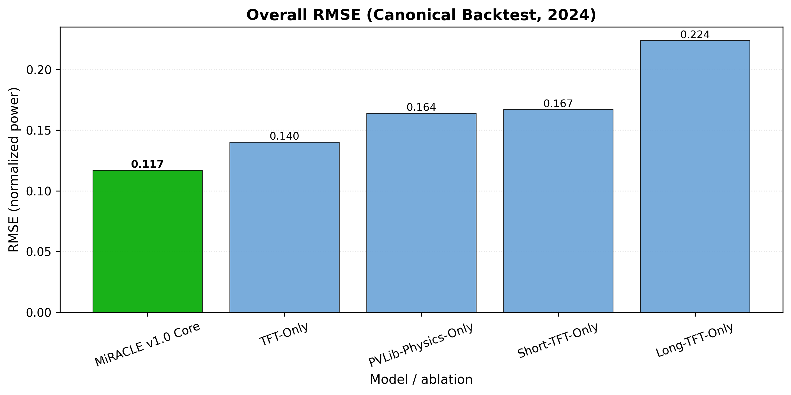

# Chapter 5 — Results & Performance Analysis

## Canonical results policy (thesis headline)

All headline quantitative claims in this chapter are taken from the **canonical 2024 inference backtests** under:

- `freeze/final_thesis_v1/benchmarks/thesis_formatted_v3/`
- `freeze/final_thesis_v1/eval/*`

These artifacts apply night filtering (**$y_{true} \ge 0.01$**) and report **N = 394,008**.

## 5.1 Overall system performance

### 5.1.1 30-day forecast performance (overall)

From the canonical benchmark suite (`text/results.md`, `tables/overall_metrics.csv`), the end-to-end performance (night-filtered) is:

Vector/PDF version: [../figures/ablations/ablation_rmse_overall.pdf](../figures/ablations/ablation_rmse_overall.pdf)

| Model | RMSE | MAE | R² |
| --- | ---: | ---: | ---: |
| MiRACLE v1.0 Core | **0.11713** | 0.084116 | 0.641595 |
| TFT-Only | 0.140186 | 0.100812 | 0.486609 |
| PVLib-Physics-Only | 0.163976 | 0.115044 | 0.29758 |
| Short-TFT-Only | 0.167144 | 0.118174 | 0.270175 |
| Long-TFT-Only | 0.223948 | 0.158866 | -0.310184 |

This establishes MiRACLE’s full integration as the strongest overall performer among the tested baselines.

### 5.1.2 Horizon-disaggregated performance (Day 1 vs Weeks 2–4)

Horizon bucket results are provided in:

- `freeze/final_thesis_v1/benchmarks/thesis_formatted_v3/tables/lead_bucket_metrics_long.csv`

Key RMSE values (MiRACLE v1.0 Core):

- **0–24h:** RMSE = 0.118582
- **2–7d:** RMSE = 0.119244
- **8–30d:** RMSE = 0.116504

For comparison, TFT-Only RMSE is consistently higher:

- **0–24h:** 0.142812
- **2–7d:** 0.140444
- **8–30d:** 0.140002

These bucketed metrics show that MiRACLE’s advantage persists across the full 30-day horizon, not only in the near-term window.

### 5.1.3 Multi-resolution performance and hierarchical effect

MiRACLE’s multi-resolution design is supported by two strands of evidence:

1. **Single-head baselines are materially worse** than the integrated system:
   - Short-TFT-only: RMSE 0.167144
   - Long-TFT-only: RMSE 0.223948

2. **Lead-time RMSE curve figure (thesis-ready):**
   - `freeze/final_thesis_v1/benchmarks/thesis_formatted_v3/figures/facets_leadtime_rmse_curve_0_24h.png`

The integrated system is designed to combine:

- high-resolution short-head detail,
- long-head long-horizon structure,
- PVLib-informed plausibility shaping.

Case-study figures are available for qualitative illustration:

- `freeze/final_thesis_v1/benchmarks/thesis_formatted_v3/figures/facets_case_summer_week.png`
- `freeze/final_thesis_v1/benchmarks/thesis_formatted_v3/figures/facets_case_winter_week.png`

## 5.2 Transfer learning effectiveness

Transfer-learning impact is evaluated as RQ2:

- `freeze/final_thesis_v1/eval/rq2_warm_vs_cold/text/results.md`

Overall RMSE:

- warm-start MiRACLE v1.0 (Core): **0.11713**
- cold-start MiRACLE v1.0 (Core, cold-start): 0.119183

Lead-bucket deltas indicate warm-start improves across:

- 0–24h (delta RMSE ≈ +0.00417 for cold-start vs warm-start)
- 2–7d (delta RMSE ≈ +0.00345)
- 8–30d (delta RMSE ≈ +0.00158)

This supports the thesis hypothesis that regional/warm initialization reduces error, particularly in the short horizon where operational calibration matters.

## 5.3 Physics-informed features impact

Physics contribution is evaluated as RQ1 (MiRACLE vs PVLib-only):

- `freeze/final_thesis_v1/eval/rq1_warm_vs_pvlib/text/results.md`

Overall RMSE:

- MiRACLE v1.0 (Core): **0.11713**
- PVLib-Physics-Only: 0.163976

This demonstrates that physics alone is not sufficient for high-accuracy forecasting in this setting, but **physics becomes highly valuable as a prior and constraint mechanism** when combined with learned models.

## 5.4 RL meta-controller performance

RL policy evaluation is captured in:

- `freeze/final_thesis_v1/eval/rq4_baseline_vs_policy/text/results.md`

Overall:

- baseline RMSE: **0.11713**
- policy RMSE: 0.117161

Lead-bucket (0–24h):

- baseline RMSE: 0.118582
- policy RMSE: 0.119484

Interpretation:

- The policy is essentially neutral overall (very small deltas), and slightly worse in the 0–24h bucket under the canonical run.
- This motivates a discussion that the RL controller is an early-stage adaptive mechanism: the architecture is in place, and the evaluation protocol is reproducible, but additional training/environment refinement is required for consistent gains.

Action distribution for the evaluated policy is included in the canonical artifact (counts of selected actions).

## 5.5 Interpretability analysis

MiRACLE’s interpretability story has two layers:

1. **TFT interpretability (model-level):** variable importance and attention-style diagnostics (available when interpretability hooks are enabled in the TFT training/evaluation pipeline).
2. **System-level interpretability:** decomposing forecasts into contributions from short-head, long-head, and PVLib components, and visualizing how blending affects plausibility.

(If desired, a dedicated interpretability figure set can be generated alongside the benchmark suite using the same `freeze/final_thesis_v1/benchmarks/thesis_formatted_v3/` workflow.)

## 5.6 Computational efficiency

Computational feasibility is addressed via:

- training-time metadata captured in experiment logs (e.g., ablation run directories under `experiments/tft/runs/germany/ablations/`),
- hardware verification (e.g., NVIDIA H100 PCIe GPUs for ablation runs as recorded in `ablation_summary_extended.csv`).

For the thesis, this section should report:

- wall-clock training time for each major stage (LSTM pretraining, TFT training, RL training),
- inference time per forecast window,
- GPU and memory requirements.

(Where exact numbers are required, they should be extracted from the saved logs rather than estimated.)

## 5.7 Robustness analysis

Robustness topics to include (and, where available, quantify):

- sensitivity under extreme weather conditions,
- behavior under missing data (gaps) and the effect of strict gap-filtered windowing,
- stability across seasonal regimes.

The benchmark suite already provides monthly breakdowns (see `monthly_metrics_long.csv`) which support a first robustness lens across seasons.

## 5.8 Summary

The canonical 2024 backtests demonstrate:

- strong overall performance of MiRACLE v1.0 Core relative to TFT-only and physics-only baselines,
- consistent gains across horizon buckets,
- measurable benefits from warm-start transfer learning,
- a reproducible RL evaluation protocol whose current policy is near-neutral, motivating future improvement.
